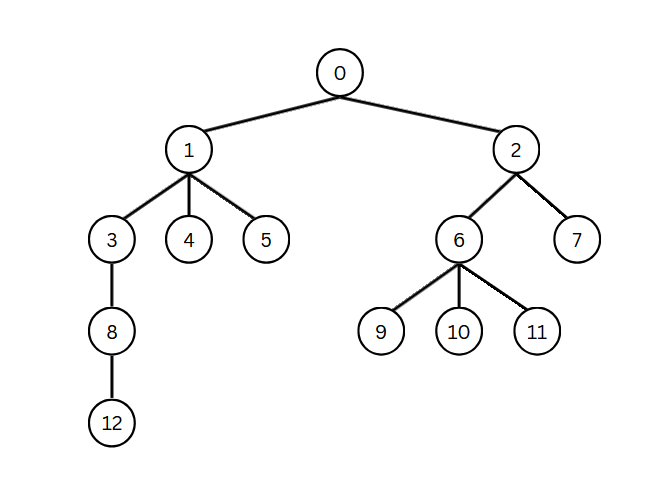
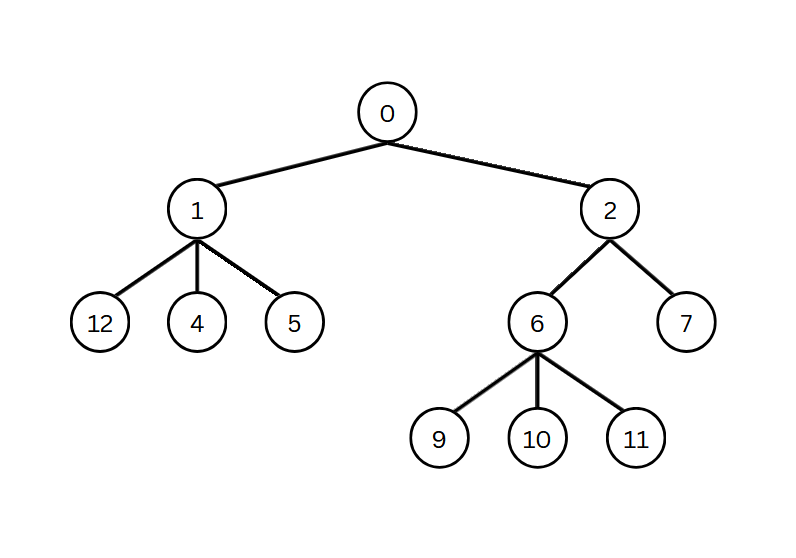

Full Example (MATLAB)
=====================

The following is a full example of (most) of PowerFlow's functionality. We will:

1. Load a network from file.

2. Simplify the network by merging chains of cables into one cable.

3. Save the modified network to file. 

4. Estimate cable parameters (r and x) for the network.

5. Estimate voltages in the network, and calculate gradients.

.. note::
    The full code as well as other related files can be found in the ``examples`` directory. 
    This example will **not** cover installation.

Loading a network from file
---------------------------

We will load ``example_network2.txt`` from file. To load a network we must create a PowerFlow solver:

.. code-block :: matlab

    % Default settings struct
    settings = struct();

    % PowerFlow solver
    pfs = PowerFlow("example_network2.txt", settings);

Default settings will be sufficient for this example. 

The network looks like this:

As we can see, nodes 4, 5, 7, 9, 10, 11, and 12, are ``LOAD`` nodes. Node 0 is the ``SLACK`` node. This network consists of only one grid, as parameter estimation is only supported for single-grid networks. Multi-grid networks will not be covered in this example.

Simplifying a network
---------------------

Take a look at nodes 3, 8, and 12. They are in series and form a chain. Parameter estimation does not work on topology like this, and it can only estimate the series impedance of the whole chain. Before performing parameter estimation we can simplify the chain using the ``simplifyNetwork()`` function. ``simplifyNetwork()`` is only supported for radial networks. We can see that the network is radial from the image, but we can also verify this using ``isRadial()``:

.. code-block :: matlab

    % Check whether the network is radial
    if (pfs.isRadial())
        % If it is radial, simplify it
        pfs.simplifyNetwork();
    end

Saving a modified network
-------------------------
After calling ``simplifyNetwork()``, the network should look like this:

As we can see, the chain has been replaced by a single cable.

We can save the network using ``save(filename)``:

.. code-block :: matlab

    % Save the simplified network to a new file
    pfs.save("example_network2_simplified.txt");

Estimating cable parameters
---------------------------

There are two supported methods for cable parameter estimation. Using ordinary least squares (OLS) / non-negative least squares (NNLS) regression, or using least absolute deviation (LAD) regression. OLS/NNLS are usually faster to perform, but are sensitive to outlier values. LAD is slower, but is more robust. Both methods are constrained to only return positive values for r and x (within tolerance).

Both methods require the following time series data:

* Slack node voltages
* Load node voltages
* Load node powers

All three of these must have the same amount of samples/columns. Some synthetic data has been provided for this network, see ``examples/demo2.m``.

We can save the nominal cable parameters using ``getImpedances()``, then estimate parameters using the two methods:

.. code-block :: matlab
    
    % Number of samples
    n = 100;
    % Number of load nodes
    nLoads = 7;
    
    % This array tells PowerFlow which measurements correspond to which load nodes
    keys = int64([4, 5, 7, 9, 10, 11, 12]);
    
    % Measurement tables
    S = zeros(nLoads, n);
    V = zeros(nLoads, n);
    V_slack = zeros(n, 1);

    % We fill S, V, and V_slack with data. 100 samples won't fit on screen here, so we don't show it. 
    % Check examples/demo2.m to see the data.

    % Save nominal parameters for comparison later
    Z_ref = pfs.getImpedances();
    
    % Estimate parameters using OLS/NNLS
    fprintf("Estimating parameters using OLS...");
    Z_ols = pfs.solveParamsOLS(keys, V, S, V_slack);
    fprintf("Done\n");
    
    % Estimate parameters using LAD
    fprintf("Estimating parameters using LAD...");
    Z_lad = pfs.solveParamsLAD(keys, V, S, V_slack);
    fprintf("Done\n");
    
    % Compare estimated parameters to nominal
    for i = 1 : length(Z_ref)
        r_ref = real(Z_ref(1, i));
        x_ref = imag(Z_ref(1, i));
        r_ols = real(Z_ols(1, i));
        x_ols = imag(Z_ols(1, i));
        r_lad = real(Z_lad(1, i));
        x_lad = imag(Z_lad(1, i));
    
        fprintf("   %i\t|| Reference Z: (%f + j%f)\t OLS Z: (%f + j%f)\t LAD Z: (%f + j%f)\n", i, r_ref, x_ref, r_ols, x_ols, r_lad, x_lad);
    end

Estimating voltages and computing gradients
-------------------------------------------

Estimating voltages and computing gradients are both done using the ``solve(S, V)`` function or the ``solveById(sKeys, S, vKeys, V)``. Computation of gradients requires the network to be radial, and must be enabled in settings. To change the settings we have to create a new solver. 

.. code-block :: matlab
    
    settings = struct();
    settings.compute_gradients = true;
    pfs = PowerFlow("example_network2_simplified.txt", settings);

To estimate voltages, we need pass ``SLACK`` voltages and ``LOAD`` power consumptions to ``solve``, one measurement for each node:

.. code-block :: matlab

    % We re-use a voltage and power sample for this demonstration
    S_sample = S(:, 1);
    V_sample = complex(V_slack(1), 0);
    
    % Solving the network to estimate state, this also computes gradients
    pfs.solve(S_sample, V_sample);

    % Alternatively we can explicitly pass in keys to the solver
    pfs.solveById(keys, S_sample, int64(0), V_sample);

We can then compare the simulated voltages to the measured voltages:

.. code-block :: matlab

    % Retrieve voltages at load nodes
    V_sim = pfs.getLoadVoltages();
    
    % Compare simulated voltages to measured voltages
    for i = 1 : length(V_sim)
        fprintf("   %d\t|| Measured V: %f\t  Simulated V: %f\n", i, abs(V(i, 1)), abs(V_sim(i)));
    end

Since we enabled gradient computation earlier, we can also retrieve gradients from the solver:

.. code-block :: matlab

    % Retrieve gradients
    dVdS = pfs.getDvDs();
    dSdS = pfs.getDsDs();
    dSlossDs = pfs.getDslossDs();
    dIdS = pfs.getDiDs();

