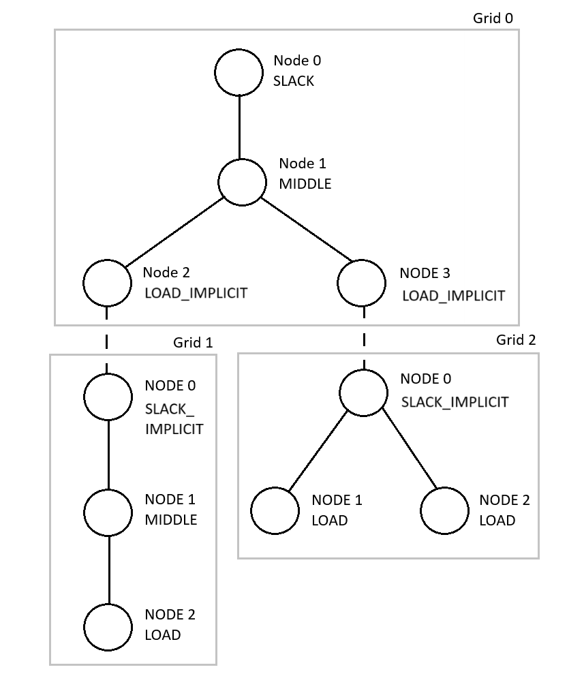

General concepts
----------------

In PowerFlow, an electrical network/power network is referred to as a *network* consisting
of one or more interconnected *grids* that each have an associated voltage level. A grid
consists of a set of *nodes* connected by *edges*, representing the cables in the grid.
A network can thus be depicted as a graph, for example:

Each edge in the graph has an associated impedance (Z) and each node has an associated
quantity depending on its type (see below). *Connections* between grids (the dashed lines
in the graph) represent ideal transformers.

Node types
~~~~~~~~~~

A grid node is of one of the following types: LOAD, LOAD_IMPLICIT, MIDDLE, SLACK,
SLACK_IMPLICIT.

- LOAD nodes are nodes where the power consumption is known and the voltage is unknown.
- LOAD_IMPLICIT nodes are similar to LOAD nodes, but the power is instead specified by a connection to another grid.
- MIDDLE nodes are nodes that are only used for branching and connections.
- SLACK nodes are nodes where the voltage is known and the power is unknown.
- SLACK_IMPLICIT nodes are similar to SLACK nodes, but the voltage is instead specified by a connection to another grid.

Note that:

- Each grid in a network must have a voltage reference. Therefore, at least one SLACK or SLACK_IMPLICIT node must exist in each grid.
- When connecting two grids, one of the nodes has to be a SLACK_IMPLICIT node and the other node has to be a LOAD_IMPLICIT node.

Per-unit
~~~~~~~~

All calculations are performed using *per-unit* values instead of actual units (Volt, Watt
etc.). Per-unit for voltages and powers are defined as:

.. code-block:: text

   V_pu = V / V_base
   S_pu = S / S_base

where *S_base* and *V_base* are positive, real-valued scale factors. Each grid in a network
has an associated S_base and V_base.

Algorithm description
~~~~~~~~~~~~~~~~~~~~~

PowerFlow calculates voltages in each grid separately using different solvers (algorithms)
depending on the structure of the grid (see "Solvers" below). Grid solvers are executed
sequentially, starting from grid 0. When all grid solvers have been executed, the voltages
and powers are transferred between all grids as specified by the connections in the network.
Then, the grid solvers are executed again and so on. The algorithm stops when PowerFlow has
detected that all grid solutions have converged within 0 iterations. 

When a network is loaded, all voltages are initially set to (1, 0). Further calculations
use the previously calculated voltages as initial guesses. For networks containing no cycles, 
it is also possible to calculate gradients and identify inaccurate cable parameters, see
:doc:`gradients` and :doc:`cable_parameters` for more information.

Solvers
~~~~~~~

PowerFlow implements three different algorithms (solvers): For grids that have a single
SLACK/SLACK_IMPLICIT node, contain no cycles and where the LOAD/LOAD_IMPLICIT nodes are
located at the "leaves", a *Backward-Forward-Sweep* (BFS) algorithm is used.

For other grids, the *ZBus Jacobi* or *Gauss-Seidel* algorithm is used. *ZBus Jacobi* can only be
used when a grid contains a single SLACK/SLACK_IMPLICIT node and when the grid doesn't
contain too many nodes. PowerFlow automatically detects which solver is most suitable for
each grid.

Limitations
~~~~~~~~~~~

Some limitations on the structure of a network are imposed by PowerFlow:

- It is not possible to have more than one edge between the same pair of nodes.
- It is not possible to have disjointed grids.
- Each grid must have at least one SLACK/SLACK_IMPLICIT node. Note that some solvers only accept a single SLACK/SLACK_IMPLICIT node.
- The same SLACK_IMPLICIT/LOAD_IMPLICIT nodes can only be used in one connection.
- Impedances cannot be 0.
- Gradient computation and cable paramater identification requires a fully radial network (i.e. a network with no cycles).